# 🚀 NebulaOps – DevOps & GitOps Platform

NebulaOps is a self-hosted DevOps and GitOps platform built from scratch to demonstrate real-world Kubernetes platform engineering, automation, GitOps workflows, ingress-based traffic management, and full observability. This project goes beyond tutorials and showcases how modern DevOps systems are designed, deployed, operated, and monitored in production environments.

---

## 🎯 Project Purpose

NebulaOps demonstrates production-grade Kubernetes platform engineering through:

- **Infrastructure Automation** – Automated cluster provisioning and configuration
- **GitOps-Based Delivery** – Declarative, Git-driven application deployments
- **Secure Traffic Routing** – Ingress-based routing with host-based rules
- **Full Observability** – Metrics collection, visualization, and monitoring
- **Operational Excellence** – Real troubleshooting and platform management skills

**Target Audience:** DevOps engineers, platform engineers, and those preparing for technical interviews.

---

## 🏗️ Architecture Overview

### Infrastructure Layout

- **servera** – Control Plane + Platform Services
- **serverb** – Worker Node (Application Workloads)

Built using **kubeadm** and managed with **Ansible**, following Kubernetes best practices.

### High-Level Architecture Flow

```
Developer
    ↓ git push
GitHub (GitOps Repository)
    ↓ Continuous Sync
ArgoCD (GitOps Engine)
    ↓ Kubernetes API
Kubernetes Cluster
    ├── Application Pods (NGINX App)
    └── Platform Services (Prometheus, Grafana)
        ↓ HTTP Routing
NGINX Ingress Controller
    ↓ NodePort / SSH Tunnel
User Browser
```

---

## 🧩 Components & Implementation

### 1️⃣ Infrastructure & Automation

- **Operating System:** Ubuntu 24.04
- **Provisioning:** Virtual machines (libvirt/KVM)
- **Configuration Management:** Ansible playbooks
- **Container Runtime:** containerd
- **Orchestration:** Kubernetes (kubeadm)

Ansible automates OS preparation, container runtime installation, and Kubernetes prerequisites across all nodes, ensuring consistency and repeatability.

---

### 2️⃣ Kubernetes Platform

- Multi-node Kubernetes cluster with proper role separation
- **CNI Plugin:** Flannel for pod networking
- **CRI Configuration:** systemd cgroups for stability
- Control plane and worker node architecture

Reflects real-world on-premises and cloud Kubernetes deployments.

---

### 3️⃣ GitOps with ArgoCD (Core Feature)

- **Single Source of Truth:** GitHub repository
- **Continuous Synchronization:** ArgoCD monitors Git for changes
- **Automated Deployment:** Changes sync automatically to cluster
- **No Manual Intervention:** Zero `kubectl apply` commands for apps

**Benefits:**
- Declarative infrastructure
- Complete audit trail
- Rollback capability
- Version control for everything

---

### 4️⃣ Application Delivery

- **Sample Application:** NGINX web server
- **Deployment Method:** GitOps via ArgoCD
- **Resources:** Kubernetes Deployment + Service
- **Traffic Management:** NGINX Ingress Controller with host-based routing

**Traffic Flow:**
```
User Request → Ingress Controller → Service → Pod
```

Demonstrates production-ready application delivery patterns.

---

### 5️⃣ Observability & Monitoring

**Metrics Collection:**
- **Metrics Server** – Resource metrics for pods and nodes
- **Prometheus** – Time-series metrics scraping and storage
- **Grafana** – Data visualization and dashboards

**Available Dashboards:**
- Node CPU and memory utilization
- Pod-level resource consumption
- Namespace-level metrics aggregation
- Cluster health and performance overview

Proves the platform is not just deployable, but fully **operable and observable**.

---

### 6️⃣ Secure Access & Networking

- **Network:** libvirt NAT network for VM isolation
- **External Access Methods:**
  - SSH tunneling for secure remote access
  - `kubectl port-forward` for service exposure

Reflects real-world lab environments and enterprise network constraints while demonstrating practical troubleshooting skills.

---

## 🧰 Technology Stack

| Category | Technologies |
|----------|-------------|
| **Automation** | Ansible |
| **Containers** | Docker, containerd |
| **Orchestration** | Kubernetes (kubeadm) |
| **Package Management** | Helm |
| **GitOps** | ArgoCD |
| **Networking** | NGINX Ingress Controller, Flannel CNI |
| **Monitoring** | Prometheus, Grafana, Metrics Server |
| **Version Control** | GitHub |

---

## 📸 Screenshots

### ArgoCD - GitOps Application Management


*ArgoCD dashboard showing NGINX application sync status and health*

### Kubernetes Cluster Status


*Multi-node Kubernetes cluster with control plane and worker nodes*


*Running pods across all namespaces including platform services*

### Grafana Monitoring Dashboards


*Cluster-level resource utilization and performance metrics*


*Pod-level CPU, memory, and resource consumption monitoring*

These screenshots provide verifiable proof of end-to-end platform operation.

---

## 📊 Architecture Diagram

```mermaid
graph LR
    %% Styling
    classDef developerStyle fill:#6c757d,stroke:#495057,stroke-width:3px,color:#fff
    classDef githubStyle fill:#24292e,stroke:#000,stroke-width:3px,color:#fff
    classDef argocdStyle fill:#ff6b35,stroke:#e85d2c,stroke-width:3px,color:#fff
    classDef k8sStyle fill:#326ce5,stroke:#2559c7,stroke-width:3px,color:#fff
    classDef nginxStyle fill:#009639,stroke:#007a2f,stroke-width:3px,color:#fff
    classDef prometheusStyle fill:#e6522c,stroke:#cc4a28,stroke-width:3px,color:#fff
    classDef grafanaStyle fill:#f46800,stroke:#d55e00,stroke-width:3px,color:#fff
    classDef browserStyle fill:#4285f4,stroke:#3367d6,stroke-width:3px,color:#fff
    classDef serverStyle fill:#8e44ad,stroke:#6c3483,stroke-width:3px,color:#fff
    
    %% Main Flow
    DEV["👨‍💻 Developer<br/>(Git Commit)"]:::developerStyle
    GH["📦 GitHub<br/>nebulaops-gitops<br/><i>Single Source of Truth</i>"]:::githubStyle
    ARGO["🔄 ArgoCD<br/><i>GitOps Engine</i><br/>Auto Sync | Desired State"]:::argocdStyle
    
    %% Kubernetes Cluster
    subgraph K8S["☸️ Kubernetes Cluster (kubeadm)"]
        direction TB
        
        subgraph CP["🖥️ Control Plane - servera"]
            CP1["• API Server<br/>• Scheduler<br/>• Controller Manager<br/>• etcd"]:::serverStyle
        end
        
        subgraph WN["🖥️ Worker Node - serverb"]
            WN1["• Application Pods<br/>• kubelet<br/>• kube-proxy"]:::serverStyle
        end
        
        APP["📦 NGINX Application<br/><i>Deployment + Pods</i>"]:::nginxStyle
        ING["🔀 NGINX Ingress Controller<br/><i>HTTP Routing</i><br/>NodePort Service"]:::nginxStyle
        
        CP1 -.-> APP
        WN1 -.-> APP
        APP --> ING
    end
    
    GATEWAY["🌐 Traffic Gateway<br/><i>SSH Tunnel / Port Forward</i>"]:::nginxStyle
    USER["🌐 User Browser<br/><i>External Access</i>"]:::browserStyle
    
    %% Observability
    PROM["📊 Prometheus<br/><i>Metrics Collection</i><br/>Scrape Metrics"]:::prometheusStyle
    GRAF["📈 Grafana<br/><i>Dashboards & Monitoring</i><br/>Visualize"]:::grafanaStyle
    
    %% Main Flow Connections
    DEV -->|"git push"| GH
    GH -->|"GitOps Sync"| ARGO
    ARGO -->|"Kubernetes API"| K8S
    ING -->|"HTTP Routing"| GATEWAY
    GATEWAY -->|"Access"| USER
    
    %% Observability Connections
    K8S -.->|"Metrics"| PROM
    PROM -->|"Visualize"| GRAF
    
    %% Styling for subgraphs
    style K8S fill:#e3f2fd,stroke:#326ce5,stroke-width:4px
    style CP fill:#fff3e0,stroke:#326ce5,stroke-width:2px
    style WN fill:#fff3e0,stroke:#326ce5,stroke-width:2px
```



*Complete architecture showing GitOps workflow, Kubernetes topology, ingress routing, and observability pipeline*

**Key Components Visualized:**
- 👨‍💻 Developer workflow with Git
- 📦 GitHub as single source of truth
- 🔄 ArgoCD GitOps automation
- ☸️ Multi-node Kubernetes cluster
- 🔀 NGINX Ingress traffic routing
- 📊 Prometheus & Grafana observability

---

## 🧠 Skills Demonstrated

This project showcases expertise in:

- ✅ **DevOps & Platform Engineering** – Building production-grade infrastructure
- ✅ **GitOps Principles** – Declarative, Git-driven deployments
- ✅ **Kubernetes Networking** – Ingress design and traffic management
- ✅ **Observability** – Metrics collection, monitoring, and visualization
- ✅ **Troubleshooting** – Container runtime, networking, and ingress issues
- ✅ **Documentation** – Clear, professional project presentation
- ✅ **Automation** – Infrastructure as Code with Ansible

---

## 🏁 Project Status

**NebulaOps v1.0** – ✅ **Completed**

Represents a stable, production-style DevOps platform ready for demonstration and portfolio use.

### 🔮 Future Enhancements (Optional)

- [ ] CI pipelines using GitHub Actions
- [ ] Advanced deployment strategies (Helm, Kustomize)
- [ ] Private repository integration with secrets management
- [ ] Cloud deployment (AWS EKS / Azure AKS / GCP GKE)
- [ ] Horizontal Pod Autoscaling (HPA)
- [ ] Load testing and performance benchmarking
- [ ] Service mesh integration (Istio/Linkerd)
- [ ] Disaster recovery and backup strategies

---

## 📚 Documentation Structure

```
nebulaops/
├── README.md
├── ansible.cfg
├── architecture/
│   └── architecture.png
├── docs/
│   └── screenshots/
│       ├── argocd-nginx-app.png
│       ├── grafana-cluster.png
│       ├── grafana-pods.png
│       ├── kubectl-nodes.png
│       └── kubectl-pods.png
└── ansible/
    ├── inventory/
    │   └── hosts.ini
    ├── playbooks/
    │   ├── bootstrap.yml
    │   └── kubernetes.yml
    └── roles/
        ├── docker/
        ├── k8s_install/
        └── k8s_prereq/
```

---

## 🚀 Getting Started

1. **Clone the repository**
   ```bash
   git clone https://github.com/yourusername/nebulaops.git
   cd nebulaops
   ```

2. **Review documentation**
   - Check `docs/setup-guide.md` for detailed setup instructions
   - Review architecture diagram in `docs/architecture.png`

3. **Deploy infrastructure**
   ```bash
   cd ansible
   ansible-playbook -i inventory/hosts playbooks/cluster-setup.yml
   ```

4. **Verify deployment**
   ```bash
   kubectl get nodes
   kubectl get pods -A
   ```

---

## 👤 Author

**Saifudheen PV**  
Aspiring DevOps / AWS / Azure / Red Hat Engineer

- 🔗 [GitHub](https://github.com/yourusername)
- 💼 [LinkedIn](https://linkedin.com/in/yourprofile)
- 📧 [Email](mailto:your.email@example.com)

---

## 📝 License

This project is licensed under the MIT License - see the [LICENSE](LICENSE) file for details.

---

## 🙏 Acknowledgments

Built with inspiration from real-world DevOps practices and platform engineering patterns used in production environments.

---

## ⭐ Support

If you find this project helpful, please consider giving it a star! It helps others discover this work and motivates further development.

```
⭐ Star this repository | 🍴 Fork for your own use | 🐛 Report issues
```