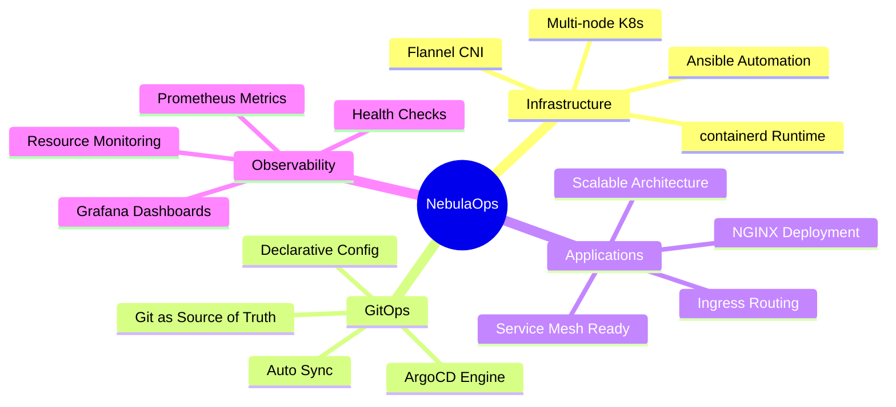
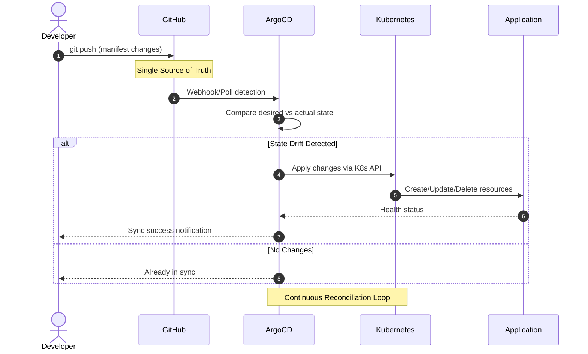
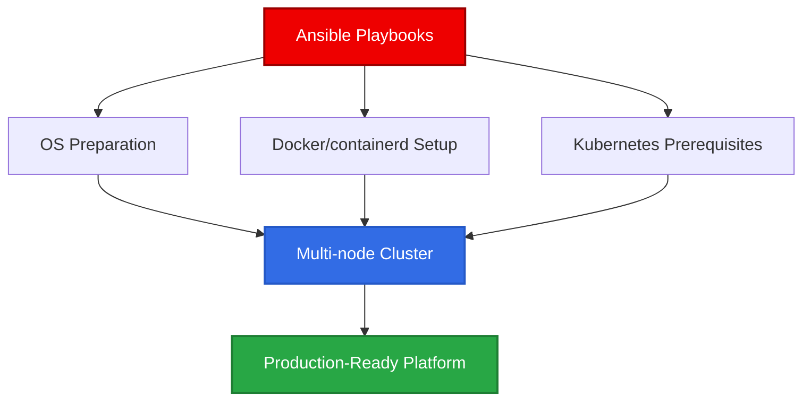
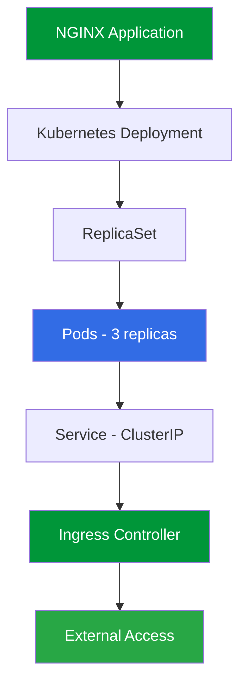
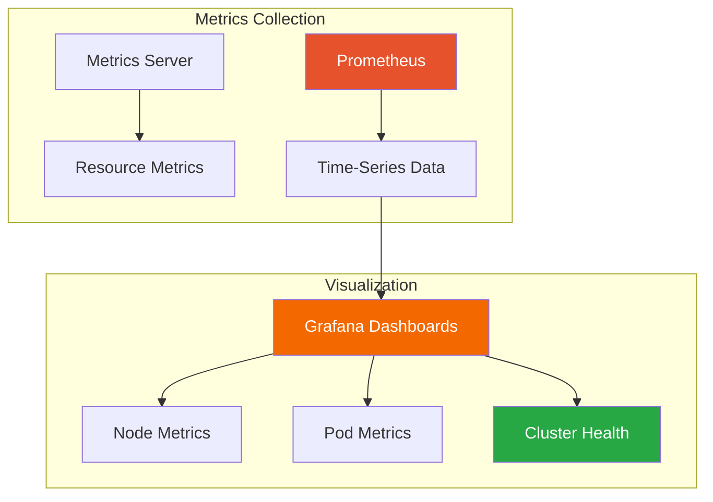
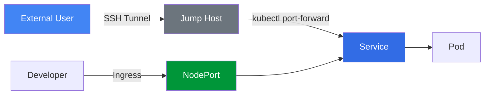
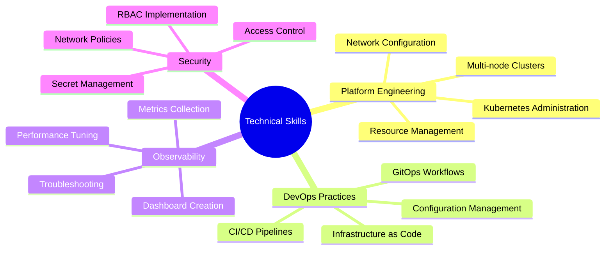
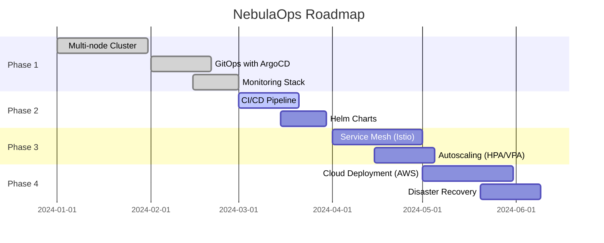
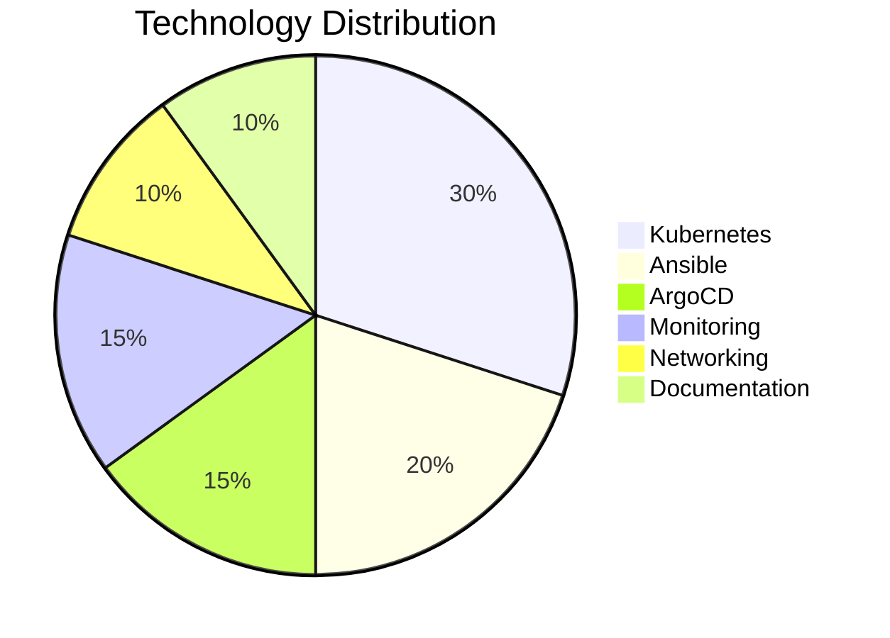

# 🚀 NebulaOps – DevOps & GitOps Platform

<div align="center">


**A production-grade DevOps platform showcasing Kubernetes orchestration, GitOps automation, and full observability**

[Features](#-key-features) • [Architecture](#-architecture-diagram) • [Screenshots](#-screenshots) • [Getting Started](#-getting-started) • [Tech Stack](#-technology-stack)

</div>

---

## 🎯 Project Purpose

NebulaOps is a **self-hosted DevOps and GitOps platform** built from scratch to demonstrate real-world Kubernetes platform engineering, automation, GitOps workflows, ingress-based traffic management, and full observability. This project goes beyond tutorials and showcases how modern DevOps systems are designed, deployed, operated, and monitored in production environments.

### 🎓 Learning Objectives

<table>
<tr>
<td width="50%">

**Infrastructure & Automation**
- ✅ Multi-node Kubernetes cluster setup
- ✅ Infrastructure as Code with Ansible
- ✅ Container runtime configuration
- ✅ Network policy implementation

</td>
<td width="50%">

**DevOps & Operations**
- ✅ GitOps-based deployments
- ✅ Continuous delivery pipelines
- ✅ Observability & monitoring
- ✅ Production troubleshooting

</td>
</tr>
</table>

**Target Audience:** DevOps Engineers, Platform Engineers, SREs, and Technical Interview Preparation

---

## ✨ Key Features



---

## 🏗️ Infrastructure Overview

### Cluster Architecture

<div align="center">

| Node | Role | Components | IP/Access |
|------|------|------------|-----------|
| **servera** | Control Plane | API Server, Scheduler, Controller Manager, etcd | Platform Services |
| **serverb** | Worker Node | kubelet, kube-proxy, Application Pods | Application Workloads |

</div>

### Technology Foundation

- **Operating System:** Ubuntu 24.04 LTS
- **Provisioning:** Virtual Machines (libvirt/KVM)
- **Configuration Management:** Ansible Playbooks
- **Container Runtime:** containerd
- **Orchestration:** Kubernetes (kubeadm)
- **Network Plugin:** Flannel CNI

---

## 📊 Architecture Diagram

```mermaid
%%{init: {'theme':'base', 'themeVariables': { 'primaryColor':'#326ce5','primaryTextColor':'#fff','primaryBorderColor':'#2559c7','lineColor':'#495057','secondaryColor':'#f46800','tertiaryColor':'#e6522c'}}}%%
graph LR
    %% Styling
    classDef developerStyle fill:#6c757d,stroke:#495057,stroke-width:3px,color:#fff,font-size:14px
    classDef githubStyle fill:#24292e,stroke:#000,stroke-width:3px,color:#fff,font-size:14px
    classDef argocdStyle fill:#ff6b35,stroke:#e85d2c,stroke-width:3px,color:#fff,font-size:14px
    classDef k8sStyle fill:#326ce5,stroke:#2559c7,stroke-width:3px,color:#fff,font-size:14px
    classDef nginxStyle fill:#009639,stroke:#007a2f,stroke-width:3px,color:#fff,font-size:14px
    classDef prometheusStyle fill:#e6522c,stroke:#cc4a28,stroke-width:3px,color:#fff,font-size:14px
    classDef grafanaStyle fill:#f46800,stroke:#d55e00,stroke-width:3px,color:#fff,font-size:14px
    classDef browserStyle fill:#4285f4,stroke:#3367d6,stroke-width:3px,color:#fff,font-size:14px
    classDef serverStyle fill:#8e44ad,stroke:#6c3483,stroke-width:3px,color:#fff,font-size:12px
    
    %% Main Flow
    DEV["👨‍💻<br/><b>Developer</b><br/><i>Git Commit</i>"]:::developerStyle
    GH["<br/><b>GitHub</b><br/>nebulaops-gitops<br/><i>Single Source of Truth</i>"]:::githubStyle
    ARGO["<br/><b>ArgoCD</b><br/><i>GitOps Engine</i><br/>Auto Sync"]:::argocdStyle
    
    %% Kubernetes Cluster
    subgraph K8S["☸️ <b>Kubernetes Cluster</b> - kubeadm"]
        direction TB
        
        subgraph CP["🖥️ Control Plane - servera"]
            CP1["<b>Master Components</b><br/>• API Server<br/>• Scheduler<br/>• Controller Manager<br/>• etcd"]:::serverStyle
        end
        
        subgraph WN["🖥️ Worker Node - serverb"]
            WN1["<b>Worker Components</b><br/>• kubelet<br/>• kube-proxy<br/>• Container Runtime"]:::serverStyle
        end
        
        APP["📦<br/><b>NGINX App</b><br/><i>Deployment</i>"]:::nginxStyle
        ING["🔀<br/><b>Ingress</b><br/><i>Routing</i>"]:::nginxStyle
        
        CP1 -.->|manages| APP
        WN1 -.->|runs| APP
        APP -->|exposes| ING
    end
    
    GATEWAY["🌐<br/><b>Gateway</b><br/><i>SSH/Port Forward</i>"]:::nginxStyle
    USER["🌐<br/><b>End User</b><br/><i>Browser</i>"]:::browserStyle
    
    %% Observability
    PROM["📊<br/><b>Prometheus</b><br/><i>Metrics</i>"]:::prometheusStyle
    GRAF["📈<br/><b>Grafana</b><br/><i>Dashboards</i>"]:::grafanaStyle
    
    %% Main Flow Connections
    DEV -->|"git push"| GH
    GH -->|"Continuous Sync"| ARGO
    ARGO -->|"Deploy via K8s API"| K8S
    ING -->|"Route Traffic"| GATEWAY
    GATEWAY -->|"HTTPS"| USER
    
    %% Observability Connections
    K8S -.->|"Scrape Metrics"| PROM
    PROM -->|"Query & Visualize"| GRAF
    
    %% Styling for subgraphs
    style K8S fill:#e3f2fd,stroke:#326ce5,stroke-width:4px,rx:10,ry:10
    style CP fill:#fff3e0,stroke:#326ce5,stroke-width:2px,rx:5,ry:5
    style WN fill:#fff3e0,stroke:#326ce5,stroke-width:2px,rx:5,ry:5
```



<div align="center">

**GitOps Flow:** Developer → GitHub → ArgoCD → Kubernetes → Ingress → User

**Observability:** Kubernetes → Prometheus → Grafana

</div>

---

## 🔄 GitOps Workflow



---

## 🧩 Component Deep Dive

### 1️⃣ Infrastructure & Automation

<div align="center">



</div>

**Automation Features:**
- 🔧 Idempotent playbooks for consistent setup
- 📦 Modular roles (docker, k8s_prereq, k8s_install)
- 🔐 Secure configuration management
- ⚡ Rapid cluster deployment and teardown

---

### 2️⃣ Kubernetes Platform

<table>
<tr>
<td width="50%">

**Control Plane (servera)**
- API Server - Cluster gateway
- Scheduler - Pod placement
- Controller Manager - State reconciliation
- etcd - Distributed key-value store

</td>
<td width="50%">

**Worker Node (serverb)**
- kubelet - Node agent
- kube-proxy - Network proxy
- Container Runtime - containerd
- Pod execution environment

</td>
</tr>
</table>

**Networking:**
- **CNI Plugin:** Flannel (overlay network)
- **Pod CIDR:** 10.244.0.0/16
- **Service CIDR:** 10.96.0.0/12
- **DNS:** CoreDNS for service discovery

---

### 3️⃣ GitOps with ArgoCD

<div align="center">


</div>

**Why GitOps?**


**Benefits:**
- ✅ Declarative infrastructure definitions
- ✅ Complete audit trail of all changes
- ✅ Easy rollback capabilities
- ✅ Automated synchronization
- ✅ No manual `kubectl apply` commands

**ArgoCD Features in Use:**
- Auto-sync enabled
- Self-healing applications
- Sync waves for ordered deployments
- Health status monitoring
- Rollback functionality

---

### 4️⃣ Application Delivery



**Traffic Flow:**
```
User Request → Ingress Controller → Service → Pod (Load Balanced)
```

**Deployment Features:**
- Rolling updates with zero downtime
- Health checks (liveness & readiness probes)
- Resource limits and requests
- Host-based routing via Ingress

---

### 5️⃣ Observability Stack

<div align="center">



</div>

**Monitoring Capabilities:**

| Metric Type | Data Points | Dashboard |
|-------------|-------------|-----------|
| **Node Metrics** | CPU, Memory, Disk, Network | Cluster Overview |
| **Pod Metrics** | Resource usage, Restarts, Status | Pod Performance |
| **Namespace** | Aggregated metrics by namespace | Namespace View |
| **Cluster Health** | API server, etcd, scheduler status | System Health |

**Prometheus Scrape Targets:**
- Kubernetes API server
- Node exporters
- Pod metrics
- Service endpoints

---

### 6️⃣ Networking & Access



**Access Methods:**
1. **SSH Tunneling** - Secure remote access to cluster
2. **kubectl port-forward** - Direct service exposure
3. **Ingress Controller** - Production HTTP/HTTPS routing
4. **NodePort** - Development and testing access

**Network Security:**
- libvirt NAT network isolation
- Network policies for pod-to-pod communication
- TLS termination at ingress (optional)

---

## 🧰 Technology Stack

<div align="center">

| Category | Technology | Purpose | Version |
|----------|-----------|---------|---------|
| **Automation** |  | Infrastructure provisioning | 2.15+ |
| **Containers** |  | Image building | 24.0+ |
| **Runtime** |  | Container runtime | 1.7+ |
| **Orchestration** |  | Container orchestration | 1.28+ |
| **GitOps** |  | Continuous delivery | 2.9+ |
| **Networking** |  | Ingress controller | Latest |
| **CNI** |  | Pod networking | 0.24+ |
| **Monitoring** |  | Metrics collection | 2.48+ |
| **Visualization** |  | Dashboards | 10.2+ |
| **VCS** |  | Source control | - |

</div>

---

## 📸 Screenshots

<div align="center">

### ArgoCD - GitOps Application Management


*ArgoCD dashboard showing NGINX application sync status, health checks, and resource tree visualization*

---

### Kubernetes Cluster Status

<table>
<tr>
<td width="50%">

<p><i>Multi-node cluster with control plane and worker nodes</i></p>
</td>
<td width="50%">

<p><i>Running pods across all namespaces</i></p>
</td>
</tr>
</table>

---

### Grafana Monitoring Dashboards

<table>
<tr>
<td width="50%">

<p><i>Cluster-level resource utilization metrics</i></p>
</td>
<td width="50%">

<p><i>Pod-level CPU and memory monitoring</i></p>
</td>
</tr>
</table>

</div>

---

## 🧠 Skills Demonstrated



<div align="center">

| Skill Category | Technologies | Proficiency |
|----------------|-------------|-------------|
| **Container Orchestration** | Kubernetes, Docker, containerd | ⭐⭐⭐⭐⭐ |
| **Infrastructure Automation** | Ansible, IaC | ⭐⭐⭐⭐⭐ |
| **GitOps & CD** | ArgoCD, Git | ⭐⭐⭐⭐⭐ |
| **Monitoring & Observability** | Prometheus, Grafana | ⭐⭐⭐⭐⭐ |
| **Networking** | Ingress, CNI, Service Mesh | ⭐⭐⭐⭐ |
| **Troubleshooting** | Debugging, Log Analysis | ⭐⭐⭐⭐⭐ |

</div>

---

## 🚀 Getting Started

### Prerequisites

```bash
# Ubuntu 24.04 LTS or similar
# Minimum 4GB RAM per node
# 2 CPUs per node
# 20GB disk space
```

### Quick Start

```bash
# 1. Clone the repository
git clone https://github.com/yourusername/nebulaops.git
cd nebulaops

# 2. Update inventory with your server IPs
nano ansible/inventory/hosts.ini

# 3. Run bootstrap playbook
cd ansible
ansible-playbook -i inventory/hosts.ini playbooks/bootstrap.yml

# 4. Install Kubernetes cluster
ansible-playbook -i inventory/hosts.ini playbooks/kubernetes.yml

# 5. Verify cluster
kubectl get nodes
kubectl get pods -A
```

### Deployment Steps


---

## 📚 Project Structure

```
nebulaops/
├── 📄 README.md                    # This file
├── 📄 ansible.cfg                  # Ansible configuration
│
├── 📁 ansible/                     # Infrastructure automation
│   ├── 📁 inventory/
│   │   └── hosts.ini              # Server inventory
│   ├── 📁 playbooks/
│   │   ├── bootstrap.yml          # Initial setup
│   │   └── kubernetes.yml         # K8s installation
│   └── 📁 roles/
│       ├── docker/                # Docker setup
│       ├── k8s_install/          # Kubernetes install
│       └── k8s_prereq/           # Prerequisites
│
├── 📁 docs/                        # Documentation
│   └── 📁 screenshots/            # Evidence & demos
│       ├── argocd-nginx-app.png
│       ├── grafana-cluster.png
│       ├── grafana-pods.png
│       ├── kubectl-nodes.png
│       └── kubectl-pods.png
│
└── 📁 manifests/ (optional)        # Kubernetes manifests
    ├── applications/              # App deployments
    ├── ingress/                   # Ingress rules
    └── monitoring/                # Prometheus & Grafana
```

---

## 🏁 Project Status

<div align="center">

### NebulaOps v1.0 - ✅ Completed


</div>

**Current Features:**
- ✅ Multi-node Kubernetes cluster (kubeadm)
- ✅ Ansible-based automation
- ✅ ArgoCD GitOps implementation
- ✅ NGINX Ingress Controller
- ✅ Prometheus + Grafana monitoring
- ✅ Complete documentation with screenshots

---

## 🔮 Future Enhancements



### Planned Features

- [ ] **CI Pipeline** - GitHub Actions for automated testing
- [ ] **Helm Integration** - Package management with Helm charts
- [ ] **Kustomize** - Environment-specific configurations
- [ ] **Secret Management** - HashiCorp Vault or Sealed Secrets
- [ ] **Service Mesh** - Istio or Linkerd integration
- [ ] **Autoscaling** - HPA and VPA implementation
- [ ] **Cloud Deployment** - AWS EKS / Azure AKS / GCP GKE
- [ ] **Backup & DR** - Velero for cluster backups
- [ ] **Load Testing** - K6 or Locust integration
- [ ] **Security Scanning** - Trivy, Falco, OPA

---

## 🤝 Contributing

Contributions are welcome! Please feel free to submit a Pull Request.

```bash
# Fork the repository
# Create your feature branch
git checkout -b feature/AmazingFeature

# Commit your changes
git commit -m 'Add some AmazingFeature'

# Push to the branch
git push origin feature/AmazingFeature

# Open a Pull Request
```

---

## 📝 License

This project is licensed under the MIT License - see the [LICENSE](LICENSE) file for details.

---

## 👤 Author

<div align="center">

### **Saifudheen PV**

**DevOps Engineer | Cloud Enthusiast | Platform Engineering**

[](https://github.com/Saifudheenpv)
[](https://linkedin.com/in/saifudheenpv07)
[](mailto:mesaifudheenpv@gmail.com)

**Specializations:**
- ☁️ Cloud Platforms: AWS | Azure | GCP
- 🔧 DevOps Tools: Kubernetes | Docker | Terraform
- 📊 Monitoring: Prometheus | Grafana | ELK Stack
- 🔄 CI/CD: Jenkins | GitLab CI | GitHub Actions

</div>

---

## 🙏 Acknowledgments

<div align="center">

Built with inspiration from real-world DevOps practices and platform engineering patterns used in production environments.

**Special Thanks To:**
- Kubernetes Community for excellent documentation
- ArgoCD team for GitOps innovation
- CNCF for open-source ecosystem
- DevOps community for knowledge sharing

</div>

---

## 📊 Project Statistics

<div align="center">



</div>

---

## ⭐ Support This Project

<div align="center">

If you find NebulaOps helpful, please consider:

⭐ **Starring** this repository

🍴 **Forking** for your own use

🐛 **Reporting** issues you encounter

💡 **Contributing** new features

📢 **Sharing** with the community

---

### Star History

[](https://star-history.com/#Saifudheenpv/nebulaops&Date)

---

**Made with ❤️ by Saifudheen PV**

*"Building platforms that engineers love to use"*

</div>

---

<div align="center">


**© 2024 NebulaOps. All Rights Reserved.**

</div>